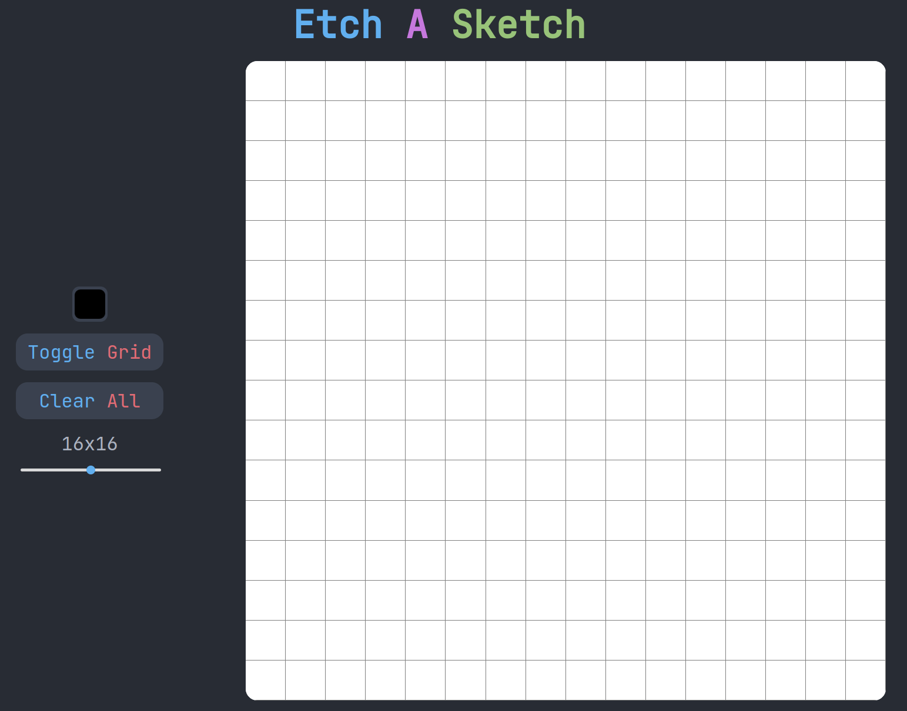

# etch-a-sketch
Pixel art creation tool.
* Select your color and paint.
* Use Alt + Click to quickly select a color from the canvas.
* Use Right Click to erase.
* Erase everything with the clear button.
* Change the grid size.
* Toggle the grid on and off.

